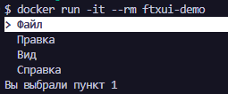
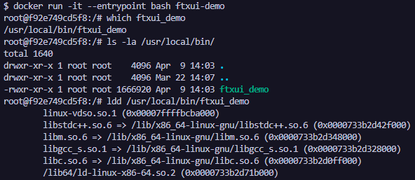
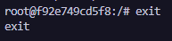

## Dockerfile. Консольное приложение на C++ и FTXUI

FTXUI — это библиотека для создания продвинутых терминальных пользовательских интерфейсов (TUI).

### Шаг 1: Создание структуры проекта

В каталоге для Docker-проектов создаем одной bash-командой всю структуру для нового приложения и переходим в созданную директорию:
``` bash
mkdir -p cpp-ftxui && touch cpp-ftxui/Dockerfile cpp-ftxui/main.cpp cpp-ftxui/CMakeLists.txt && cd cpp-ftxui
```

Общая структура проекта должна выглядеть следующим образом:
```
cpp-ftxui/
├── CMakeLists.txt
├── Dockerfile
└── main.cpp
```

### Шаг 2: Написание исходного кода приложения main.cpp

Записываем в файл main.cpp код консольного приложения с интерактивным меню:
``` cpp
#include <functional>
#include <iostream>
#include <string>
#include <vector>
#include <ftxui/component/captured_mouse.hpp>
#include <ftxui/component/component.hpp>
#include <ftxui/component/component_options.hpp>
#include <ftxui/component/screen_interactive.hpp>

int main() {
  using namespace ftxui;
  auto screen = ScreenInteractive::TerminalOutput();
  std::vector<std::string> entries = {
      "Файл",
      "Правка",
      "Вид",
      "Справка",
  };
  int selected = 0;
  MenuOption option;
  option.on_enter = screen.ExitLoopClosure();
  auto menu = Menu(&entries, &selected, option);
  screen.Loop(menu);
  std::cout << "Вы выбрали пункт " << selected + 1 << std::endl;
  return 0;
}
```

### Шаг 3: Написание конфигурационного файла конфигурации сборки CMakeLists.txt

Записываем в файл CMakeLists.txt инструкции для автоматического скачивания зависимости библиотеки FTXUI и линковки исполняемого файла:
``` cmake
cmake_minimum_required(VERSION 3.10)
project(ftxui_demo)

# Указываем стандарт C++17 (FTXUI требует C++17)
set(CMAKE_CXX_STANDARD 17)
set(CMAKE_CXX_STANDARD_REQUIRED ON)

# Подключаем FetchContent для загрузки FTXUI
include(FetchContent)
FetchContent_Declare(ftxui
  GIT_REPOSITORY https://github.com/ArthurSonzogni/FTXUI.git
  GIT_TAG v5.0.0  # можно использовать последний тег
)
FetchContent_MakeAvailable(ftxui)

# Создаём исполняемый файл
add_executable(ftxui_demo main.cpp)

# Линкуем библиотеки FTXUI
target_link_libraries(ftxui_demo PRIVATE
  ftxui::component
  ftxui::dom
  ftxui::screen
)
```

### Шаг 4: Написание Dockerfile (Многоэтапная сборка)

Записываем в файл Dockerfile инструкции для двухэтапной сборки проекта:
``` dockerfile
# ---- Этап 1: сборка ----
FROM ubuntu:22.04 AS build
# Устанавливаем необходимые пакеты для сборки
RUN apt-get update && apt-get install -y \
    build-essential \
    cmake \
    git \
    && rm -rf /var/lib/apt/lists/*
# Создаём рабочую директорию
WORKDIR /app
# Копируем исходники
COPY main.cpp CMakeLists.txt ./
# Собираем проект
RUN mkdir build && cd build && \
    cmake .. && \
    make

# ---- Этап 2: финальный образ ----
FROM ubuntu:22.04
# Устанавливаем только необходимые рантайм-библиотеки
RUN apt-get update && apt-get install -y \
    libstdc++6 \
    && rm -rf /var/lib/apt/lists/*
# Копируем собранный бинарник из этапа сборки
COPY --from=build /app/build/ftxui_demo /usr/local/bin/ftxui_demo
# Запускаем приложение
CMD ["ftxui_demo"]
```

### Шаг 5: Сборка Docker-образа

В командной строке, находясь в папке cpp-ftxui, запускаем процесс сборки:docker build -t ftxui-demo .
> Флаг -t задает имя образа

*Примечание: Сборка займет больше времени, чем обычно, так как CMake выполнит клонирование репозитория FTXUI из сети и скомпилирует его библиотеки на этапе build.*

### Шаг 6: Создание и запуск контейнера
Поскольку приложение является интерактивным терминальным интерфейсом, для его корректной работы обязательно указывать флаги -it (выделение псевдотерминала и интерактивный режим):
docker run -it --rm ftxui-demo


### Шаг 7: Войти в контейнер для исследования

Для отладки, проверки структуры слоев финального образа и инспекции связанных динамических библиотек утилитой ldd можно войти внутрь работающего контейнера, переопределив точку входа на командный интерпретатор bash:docker run -it --entrypoint bash ftxui-demo


### Шаг 8: Выход из контейнера

Для завершения интерактивной сессии отладки и закрытия терминала внутри контейнера выполните команду:exit

