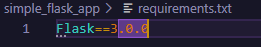
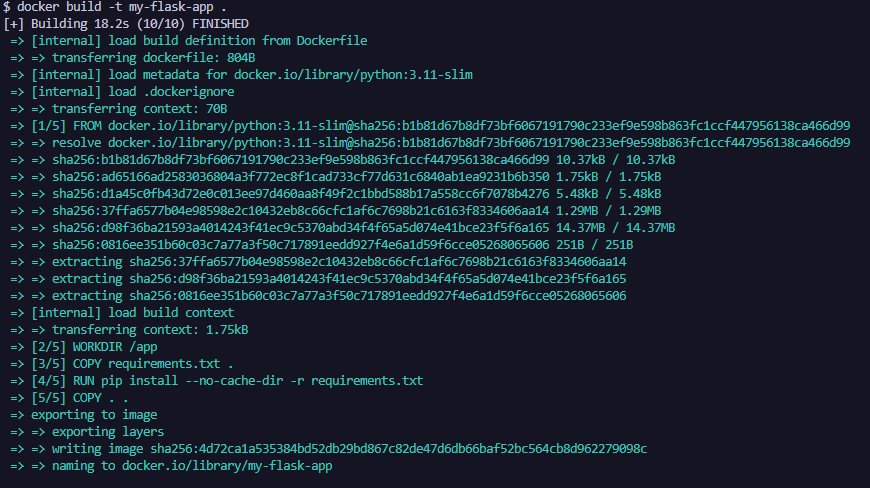
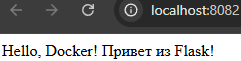
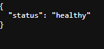

## Dockerfile. Flask+Python (мини-проект)

### Шаг 1: Создание структуры проекта

В каталоге для Docker-проектов создаем одной bash-командой всю структуру для нового приложения и переходим в созданную директорию:
``` bash
mkdir -p simple_flask_app && touch simple_flask_app/app.py simple_flask_app/requirements.txt simple_flask_app/Dockerfile simple_flask_app/.dockerignore && cd simple_flask_app
```

Общая структура проекта должна выглядеть следующим образом:
```
simple_flask_app/
├── app.py              # простое Flask-приложение
├── requirements.txt    # список зависимостей Python
├── Dockerfile          # инструкции для сборки образа
└── .dockerignore       # чтобы исключить ненужные файлы сборки
```

### Шаг 2: Заполнение файла зависимостей requirements.txt

Записываем в файл requirements.txt необходимую версию фреймворка:Flask==3.0.0



### Шаг 3: Описание файла .dockerignore

Записываем в файл .dockerignore исключения, чтобы не копировать лишний локальный мусор в контейнер:
```
__pycache__
*.pyc
.git
.env
```

### Шаг 4: Написание Dockerfile

Записываем в файл Dockerfile пошаговый рецепт сборки нашего веб-приложения:# Базовый образ – официальный легковесный Python
``` dockerfile
FROM python:3.11-slim
# Устанавливаем рабочую директорию внутри контейнера
WORKDIR /app
# Копируем файл с зависимостями сначала (используем кэш слоёв)
COPY requirements.txt .
# Устанавливаем зависимости
RUN pip install --no-cache-dir -r requirements.txt
# Копируем остальные файлы проекта
COPY . .
# Указываем, какой порт будет слушать приложение внутри контейнера
EXPOSE 5000
# Команда для запуска приложения
CMD ["python", "app.py"]
```

### Шаг 5: Создание исходного кода app.py

Записываем код простого Flask-приложения в файл app.py:
``` python
from flask import Flask

# Создаём экземпляр приложения
app = Flask(__name__)

# Определяем маршрут для главной страницы
@app.route('/')
def hello():
    return "Hello, Docker! Привет из Flask!"

# Эндпоинт для проверки работоспособности (healthcheck)
@app.route('/health')
def health():
    return {"status": "healthy"}, 200

# Запускаем приложение, если файл выполняется напрямую
if __name__ == '__main__':
    # Важно: слушаем на всех интерфейсах (0.0.0.0), чтобы контейнер был доступен снаружи
    app.run(host='0.0.0.0', port=5000, debug=True)
```

### Шаг 6: Сборка Docker-образа

В командной строке, находясь в папке simple_flask_app, выполняем сборку образа:docker build -t my-flask-app .
> Флаг -t задает имя образа



### Шаг 7: Создание и запуск контейнера

Запускаем контейнер в фоновом режиме с пробросом внутреннего порта 5000 наружу на порт 8082 хост-машины:docker run -d --name my-running-app -p 8082:5000 my-flask-app

### Шаг 8: Проверка работы в браузере

Открываем браузер и проверяем доступность приложения по адресу: [http://localhost:8082](http://localhost:8082)



Для проверки работоспособности эндпоинта healthcheck переходим по адресу: [http://localhost:8082/health](http://localhost:8082/health)

