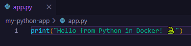
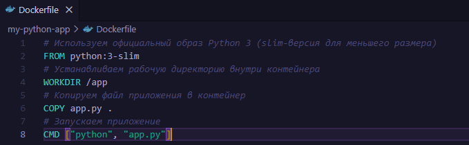
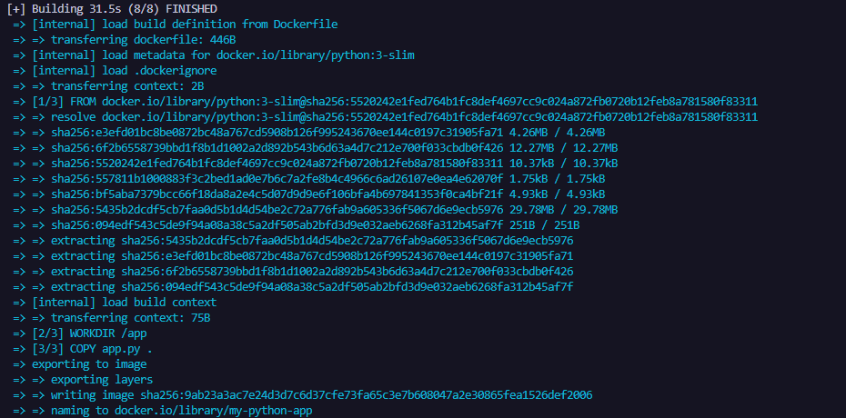

## Dockerfile. Простое приложение на Python

### Шаг 1: Создание структуры проекта

Структура проекта должна выглядеть следующим образом:
```
my-python-app/
├── Dockerfile
└── app.py
```

В каталоге для Docker-проектов создаем всей структуре для нового приложения одной bash-командой и переходим в целевую папку:
``` bash
mkdir -p my-python-app && touch my-python-app/Dockerfile my-python-app/app.py && cd my-python-app
```

### Шаг 2: Создание скрипта приложения app.py

Записываем в созданный файл app.py код программы:print("Hello from Python in Docker! 🐍")



### Шаг 3: Написание Dockerfile

Записываем в файл Dockerfile инструкции для сборки окружения:# Используем официальный образ Python 3 (slim-версия для меньшего размера)
``` dockerfile
FROM python:3-slim
# Устанавливаем рабочую директорию внутри контейнера
WORKDIR /app
# Копируем файл приложения в контейнер
COPY app.py .
# Запускаем приложение
CMD ["python", "app.py"]

```

### Шаг 4: Сборка Docker-образа

В командной строке, находясь в папке my-python-app, выполняем команду сборки локального образа:
```bash
docker build -t my-python-app .
```
> Флаг -t задает имя образа



### Шаг 5: Создание и запуск контейнера

Запускаем собранный контейнер с автоматическим удалением после выполнения задачи:docker run --rm my-python-app
> Флаг --rm автоматически удаляет контейнер после остановки

Если всё прошло успешно, в консоли отобразится приветственное сообщение от интерпретатора Python внутри контейнера:


