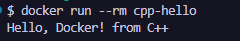
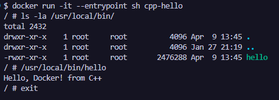

## Dockerfile. Hello, World на C++

C++ — компилируемый, статически типизированный язык программирования общего назначения. Сочетает свойства высокоуровневых и низкоуровневых языков, поддерживает несколько парадигм программирования.

### Шаг 1: Создание структуры проекта

В каталоге для Docker-проектов создаем всей структуре для нового приложения одной bash-командой и переходим в созданную директорию:
``` bash
mkdir -p cpp-docker && touch cpp-docker/Dockerfile cpp-docker/hello.cpp && cd cpp-docker
```

Общая структура проекта должна выглядеть следующим образом:
```
cpp-docker/
├── Dockerfile
└── hello.cpp
```

### Шаг 2: Написание исходного кода приложения hello.cpp

Записываем в файл hello.cpp базовый код программы:
``` cpp
#include <iostream>

int main() {
    std::cout << "Hello, Docker! from C++" << std::endl;
    return 0;
}
```

### Шаг 3: Написание Dockerfile (Многоэтапная сборка)

Записываем в файл Dockerfile инструкции для сборки. Проект использует Multi-stage build для минимизации размера финального контейнера:
``` dockerfile
# ---- Этап 1: сборка ----
FROM gcc:latest AS build
# Устанавливаем рабочую директорию
WORKDIR /app
# Копируем исходный код
COPY hello.cpp .
# Компилируем статически, чтобы не зависеть от динамических библиотек
RUN g++ -static -o hello hello.cpp

# ---- Этап 2: финальный образ ----
FROM alpine:latest
# Копируем скомпилированный бинарник из первого этапа
COPY --from=build /app/hello /usr/local/bin/hello
# Запускаем приложение
CMD ["hello"]
```

### Шаг 4: Сборка Docker-образа

В командной строке, находясь в папке cpp-docker, выполняем команду сборки локального образа:docker build -t cpp-hello .
*Примечание: Сборка выполнит компиляцию на первом этапе (build) и затем перенесет готовый бинарный файл в минимальный финальный образ на основе Alpine Linux.*

### Шаг 5: Создание и запуск контейнера

Запускаем собранный контейнер с флагом автоматического удаления после завершения работы процесса:docker run --rm cpp-hello



### Шаг 6: Интерактивный вход в контейнер для исследования

Для изучения внутреннего окружения контейнера (например, проверки размера и наличия бинарного файла) переопределяем точку входа и запускаем командную оболочку:docker run -it --entrypoint sh cpp-hello

Для завершения сессии и выхода из контейнера введите команду:exit

