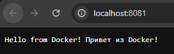

## Dockerfile. Приложение на C# (.NET)

### Шаг 1: Создание структуры проекта

В каталоге для Docker-проектов создаем одной bash-командой всю структуру для нового приложения и переходим в созданную директорию:
``` bash
mkdir -p MyApp && touch MyApp/Program.cs MyApp/MyApp.csproj MyApp/Dockerfile && cd MyApp
```

Общая структура проекта должна выглядеть следующим образом:
```
MyApp/
├── Dockerfile
├── MyApp.csproj
└── Program.cs
```

### Шаг 2: Заполнение файла проекта MyApp.csproj

Записываем в созданный файл MyApp.csproj конфигурацию проекта:<Project Sdk="Microsoft.NET.Sdk.Web">
  <PropertyGroup>
    <TargetFramework>net8.0</TargetFramework>
    <Nullable>enable</Nullable>
    <ImplicitUsings>enable</ImplicitUsings>
  </PropertyGroup>
</Project>

Описание содержимого файла MyApp.csproj:
* Sdk="Microsoft.NET.Sdk.Web" указывает, что это веб-приложение (включает необходимые зависимости для ASP.NET Core).
* TargetFramework — используемая версия .NET (здесь 8.0).
* ImplicitUsings подключает часто используемые пространства имён автоматически.
* Nullable включает поддержку nullable-типов.

### Шаг 3: Написание исходного кода Program.cs

Записываем в файл Program.cs код веб-приложения на C#:var app = WebApplication.Create(args);

// Определяем маршрут для корневого URL
app.MapGet("/", () => "Hello from Docker! Привет из Docker!");

// Запускаем приложение, слушая порт 80 на всех интерфейсах
app.Run("http://*:80");

Описание содержимого файла Program.cs:
* WebApplication.Create инициализирует приложение.
* app.MapGet("/", ...) задаёт обработчик для корневого пути, возвращающий строку приветствия.
* app.Run("http://*:80") заставляет приложение слушать порт 80 на всех сетевых интерфейсах (важно для работы внутри контейнера).

### Шаг 4: Написание Dockerfile (Многоэтапная сборка)

Записываем в файл Dockerfile инструкции для сборки и оптимизации финального образа:# Используем SDK для сборки
``` dockerfile
FROM mcr.microsoft.com/dotnet/sdk:8.0 AS build
WORKDIR /src
# Копируем файлы проекта и восстанавливаем зависимости
COPY ["MyApp.csproj", "."]
RUN dotnet restore "MyApp.csproj"
# Копируем весь код и публикуем приложение
COPY . .
RUN dotnet publish "MyApp.csproj" -c Release -o /app/publish
# Финальный образ с рантаймом
FROM mcr.microsoft.com/dotnet/aspnet:8.0 AS runtime
WORKDIR /app
COPY --from=build /app/publish .
# Открываем порт
EXPOSE 80
# Запускаем приложение
ENTRYPOINT ["dotnet", "MyApp.dll"]
```

### Шаг 5: Сборка Docker-образа

В командной строке, находясь в папке MyApp, выполняем команду сборки:docker build -t myapp .
> Флаг -t задает имя образа

### Шаг 6: Создание и запуск контейнера

Запускаем контейнер в фоновом режиме с привязкой портов:docker run -d -p 8081:80 --name myapp myapp

Описание команды:
* -d — фоновый режим (detached mode).
* -p 8081:80 — перенаправление: порт хоста 8081 → порт контейнера 80.
* --name myapp — уникальное имя контейнера.
* myapp — имя исходного образа.

### Шаг 7: Проверка работы веб-приложения

После успешного запуска открываем браузер по адресу: [http://localhost:8081](http://localhost:8081)

Вы должны увидеть сообщение: Hello from Docker! Привет из Docker!


