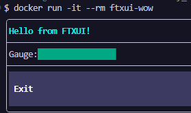
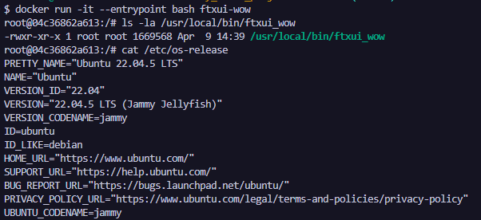
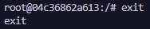

## Dockerfile. Wow - консольное псевдографическое приложение на C++ и FTXUI

FTXUI — это библиотека для создания продвинутых терминальных пользовательских интерфейсов (TUI) с поддержкой анимаций и интерактивных компонентов.

### Шаг 1: Создание структуры проекта

В каталоге для Docker-проектов создаем одной bash-командой всю структуру для нового анимационного приложения и переходим в созданную директорию:
``` bash
mkdir -p ftxui-wow && touch ftxui-wow/Dockerfile ftxui-wow/main.cpp ftxui-wow/CMakeLists.txt && cd ftxui-wow
```

Общая структура проекта должна выглядеть следующим образом:
```
ftxui-wow/
├── CMakeLists.txt
├── Dockerfile
└── main.cpp
```

### Шаг 2: Наполнение файла main.cpp (динамический индикатор загрузки)

Записываем в файл main.cpp исходный код приложения с анимированным прогресс-баром (`gauge`) и кнопкой выхода:
``` cpp
#include <chrono>
#include <thread>
#include <random>
#include <ftxui/component/captured_mouse.hpp>
#include <ftxui/component/component.hpp>
#include <ftxui/component/component_options.hpp>
#include <ftxui/component/screen_interactive.hpp>
#include <ftxui/dom/elements.hpp>

using namespace ftxui;
using namespace std::chrono_literals;

int main() {
  auto screen = ScreenInteractive::TerminalOutput();
  float value = 0.5f;
  bool increasing = true;

  // Отдельный поток для плавной анимации индикатора
  std::thread update([&] {
    while (true) {
      std::this_thread::sleep_for(50ms);
      if (increasing) {
        value += 0.01f;
        if (value > 1.0f) increasing = false;
      } else {
        value -= 0.01f;
        if (value < 0.0f) increasing = true;
      }
      screen.Post([&] {});
    }
  });

  auto quit_button = Button("Exit", screen.ExitLoopClosure(), ButtonOption::Animated());
  auto component = Renderer(quit_button, [&] {
    return vbox({
             text("Hello from FTXUI!") | bold | color(Color::Cyan),
             separator(),
             hbox({
               text("Gauge:"),
               gauge(value) | size(WIDTH, EQUAL, 30) | color(Color::Green),
             }),
             separator(),
             quit_button->Render(),
           }) | border;
  });

  screen.Loop(component);
  update.detach();
  return 0;
}


### Шаг 3: Наполнение файла CMakeLists.txt

Записываем в файл CMakeLists.txt декларацию проекта и FetchContent-зависимости для автоматической сборки FTXUI:cmake_minimum_required(VERSION 3.10)
project(ftxui_wow)

set(CMAKE_CXX_STANDARD 17)
set(CMAKE_CXX_STANDARD_REQUIRED ON)

include(FetchContent)
FetchContent_Declare(ftxui
  GIT_REPOSITORY https://github.com/ArthurSonzogni/FTXUI.git
  GIT_TAG v5.0.0
)
FetchContent_MakeAvailable(ftxui)

add_executable(ftxui_wow main.cpp)
target_link_libraries(ftxui_wow PRIVATE ftxui::component ftxui::dom ftxui::screen)
```

### Шаг 4: Написание Dockerfile

Записываем в файл Dockerfile конфигурацию для многоэтапной сборки на базе операционной системы Ubuntu 22.04:
``` dockerfile
# ---- Этап 1: сборка ----
FROM ubuntu:22.04 AS build
# Устанавливаем необходимые пакеты для сборки
RUN apt-get update && apt-get install -y \
    build-essential \
    cmake \
    git \
    && rm -rf /var/lib/apt/lists/*
# Создаём рабочую директорию
WORKDIR /app
# Копируем исходники
COPY main.cpp CMakeLists.txt ./
# Собираем проект
RUN mkdir build && cd build && \
    cmake .. && \
    make

# ---- Этап 2: финальный образ ----
FROM ubuntu:22.04
# Устанавливаем только необходимые рантайм-библиотеки
RUN apt-get update && apt-get install -y \
    libstdc++6 \
    && rm -rf /var/lib/apt/lists/*
# Копируем собранный бинарник из этапа сборки
COPY --from=build /app/build/ftxui_wow /usr/local/bin/ftxui_wow
# Запускаем приложение
CMD ["ftxui_wow"]
```

### Шаг 5: Сборка Docker-образа

В командной строке, находясь в папке ftxui-wow, запускаем компиляцию проекта и сборку образа:docker build -t ftxui-wow .
> Флаг -t задает имя образа

### Шаг 6: Создание и запуск интерактивного контейнера

Запускаем контейнер с флагами -it для активации интерактивного ввода/вывода в псевдографическом интерфейсе:docker run -it --rm ftxui-wow



### Шаг 7: Войти в контейнер для исследования

Для проведения инспекции окружения и дебага запускаем контейнер во внутреннюю оболочку bash:docker run -it --entrypoint bash ftxui-wow



### Шаг 8: Выход из контейнера

Для завершения сессии исследования контейнера введите команду закрытия терминала:
exit



> Если вы обнаружили ошибку в этом тексте - сообщите пожалуйста автору!