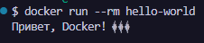

## Dockerfile. Hello-world

### Шаг 1: Создание структуры проекта

В каталоге для Docker-проектов создайте структуру проекта командой Bash:
``` bash
mkdir -p hello-world && touch hello-world/Dockerfile && cd hello-world
```

### Шаг 2: Наполнение Dockerfile

Содержимое файла Dockerfile:# Используем минимальный базовый образ Alpine Linux
``` dockerfile
FROM alpine:latest
# Команда, которая выполнится при запуске контейнера
CMD ["echo", "Привет, Docker! 🐳"]
```

### Шаг 3: Сборка Docker-образа

В командной строке, находясь в папке hello-world, выполнить:
docker build -t hello-world .
> Флаг -t задает имя образа

### Шаг 4: Создание и запуск контейнера

Создание и запуск контейнера:docker run --rm hello-world


