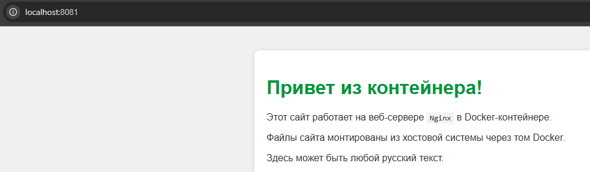
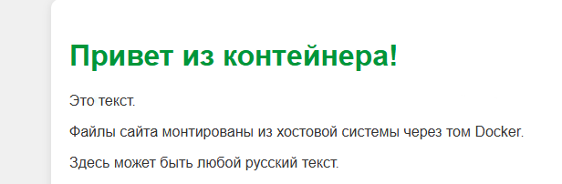

Markdown

## Dockerfile. Статический сайт на веб-сервере Nginx

### Шаг 1: Создание структуры проекта

Структура проекта должна выглядеть следующим образом:
```
my-website/
├── Dockerfile
└── index.html
```

В каталоге для Docker-проектов создаем одной bash-командой всю структуру для нового приложения и переходим в созданную директорию:
``` bash
mkdir -p my-website && touch my-website/Dockerfile my-website/index.html && cd my-website
```

### Шаг 2: Создание веб-страницы index.html

Записываем в файл index.html следующий HTML-код:
``` html
<!DOCTYPE html>
<html>
<head>
    <meta charset="UTF-8">
    <title>Мой сайт в Docker</title>
</head>
<body>
    <h1>Привет из контейнера! </h1>
    <p>Здесь может быть любой русский текст.</p>
</body>
</html>
```

### Шаг 3: Написание Dockerfile

Записываем в файл Dockerfile конфигурацию для сборки образа:# Используем официальный легковесный образ Nginx
``` dockerfile
FROM nginx:alpine
# Копируем наш HTML-файл в стандартную директорию Nginx
COPY index.html /usr/share/nginx/html/index.html
# Открываем порт (документация)
EXPOSE 80
```

### Шаг 4: Сборка Docker-образа

В командной строке, находясь в папке my-website, выполняем сборку локального образа:docker build -t my-site .
> Флаг -t задает имя образа

### Шаг 5: Создание и запуск контейнера

Запускаем контейнер в фоновом режиме с пробросом портов и монтированием тома (Volume):docker run -d -p 8081:80 --name my-site -v "$(pwd)":/usr/share/nginx/html my-site

Пояснение ключей запуска:
* -d — запуск контейнера в фоновом режиме (detached mode).
* -p 8081:80 — проброс порта 80 из контейнера на порт 8081 локальной машины.
* -v "$(pwd)":/usr/share/nginx/html — монтирует текущую локальную папку (где лежит `index.html`) в директорию, откуда Nginx берёт файлы.
* *Примечание:* Конструкция $(pwd) используется в Linux/macOS/Git Bash; в среде PowerShell используйте ${PWD}.



### Шаг 6: Проверка работы и демонстрация "горячей" перезагрузки

Теперь любые изменения в index.html на хост-машине мгновенно отобразятся на сайте (достаточно просто обновить страницу в браузере без перезапуска самого Docker-контейнера).

Для проверки открываем в браузере страницу: [http://localhost:8081](http://localhost:8081)


